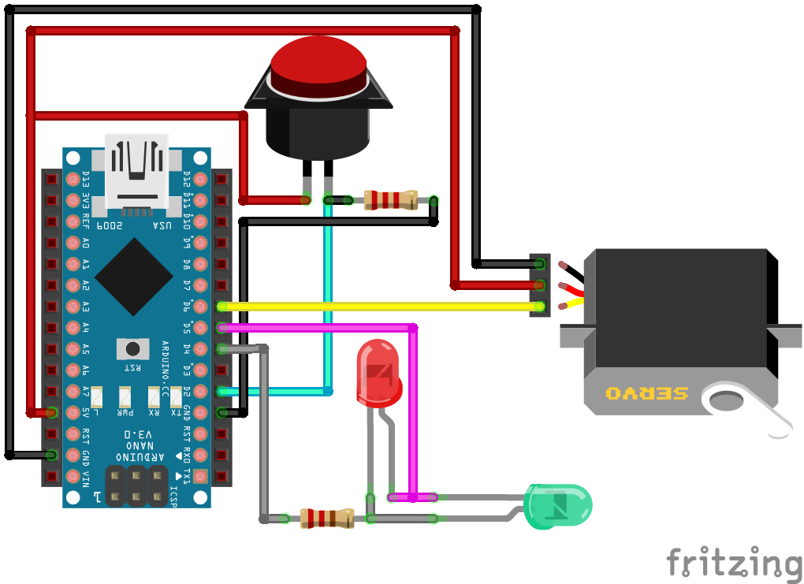
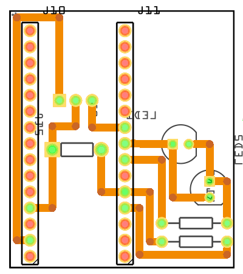
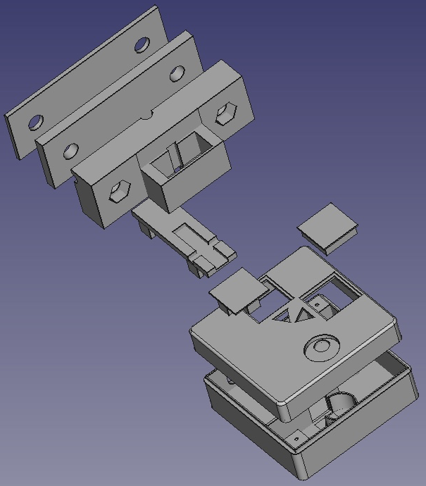

# Arduino Light Source Switch

*This repository contains all the informations about the design of an automated light source switch for microscopy.*

Original idea, thinking and design: [Fabrice P . Cordelières](https://github.com/fabricecordelieres) and [Patrice Mascalchi](https://github.com/pmascalchi).
Trick to make Arduino controllable from MicroManager by mimicking a device's communication protocol inspired by [Jérôme Mutterer](https://github.com/mutterer)

## Required parts

|Name|Link on Amazon.fr/Conrad.fr|Price (in euros)|Required|Actual cost (in euros)|
|---|---|---|---|---|
|PCB|[Copper Clad - TOOGOO(R) 10PCS FR4 Printed Circuit Laminate Board Single Sided Copper Clad PCB Fiber](https://www.amazon.fr/gp/product/B01DXF905Y/ref=oh_aui_search_detailpage?ie=UTF8&psc=1)|4.44|1|4.44|
|BluePrint transfer sheets|[5 feuilles PNP Blue pour circuits imprimés](http://www.conrad.fr/ce/fr/product/068815/5-feuilles-PNP-Blue-pour-circuits-imprims?queryFromSuggest=true)|19.99|1|4.00|
|Iron perchlorate|[Perchlorure de fer en granulé pour 1 litre d'eau](https://www.amazon.fr/perchlorure-fer-granul%C3%A9-pour-litre/dp/B004INQ4KK/ref=sr_1_2?ie=UTF8&qid=1514118209&sr=8-2&keywords=perchlorure+de+fer)|22.00|1|22.00|
|Arduino Nano|[Kuman 10 x Mini Nano V3.0 ATmega328P 5V 16M Micro Controller Board Module pour Arduino KY64-10](https://www.amazon.fr/gp/product/B01NCM5W9O/ref=oh_aui_detailpage_o08_s00?ie=UTF8&psc=1)|32,80|1|3.28|
|Stackable straight female pin headers for Arduino|[VAPKER 18 Type 2.54mm Single Row Empilable Femelle Pitch Straight Female Pin Header Kit Pour Arduino](https://www.amazon.fr/gp/product/B06XTMGWCL/ref=oh_aui_detailpage_o03_s00?ie=UTF8&psc=1)|7.92|1|3.96|
|Green & Red LEDs|[Elegoo 3mm et 5mm Diffusé et Transparent le Kit LED Diode Electro Luminescente Assorti 5 Couleurs pour Arduino (Pack de 600)](https://www.amazon.fr/gp/product/B073CYK8X5/ref=oh_aui_detailpage_o04_s00?ie=UTF8&psc=1)|10.99|2|0.04|
|220 Ohms and 2.2 KOhms resistors|[Elegoo 17 Values 1% Assortiment de Kit de Resistor 0 Ohm-1M Ohm (Pack of 525) avec Boîte en Plastique pour Arduino et Projet Expérimental](https://www.amazon.fr/Elegoo-Assortiment-Resistor-Plastique-Exp%C3%A9rimental/dp/B071LHFQKD/ref=sr_1_1?ie=UTF8&qid=1514118669&sr=8-1&keywords=resistances)|9.99|1|0.04|
|Push button|[SODIAL(R) 5 x Momentary SPST NO Red Round Cap Push Button Switch AC 6A/125V 3A/250V](https://www.amazon.fr/gp/product/B00F4MGQU2/ref=oh_aui_search_detailpage?ie=UTF8&psc=1)|1.89|1|0.38|
|Servo|[Kuman KY66 Micro Servomoteur SG90 10pcs, 9G Robot Contrôle D'hélicoptère, Avion, Bateau, Mini Servo 450](https://www.amazon.fr/gp/product/B01MXPTCHO/ref=oh_aui_detailpage_o05_s00?ie=UTF8&psc=1)|23.00|1|2.30|
|2.9mmx13mm screws|[uxcell 2.9mmx13mm Phillips Round Head Self Tapping Screws 50 Pcs](https://www.amazon.fr/sourcingmap%C2%AE-2-9Mmx13mm-inoxydable-cruciforme-autotaraudeuses/dp/B019ETFW7I/ref=sr_1_fkmr0_1?ie=UTF8&qid=1514660189&sr=8-1-fkmr0&keywords=2.9mmx13mm+s)|10.10|2|0.40|
|USB Cable|[AmazonBasics USB 2.0 Cable - A-Male to Mini-B - 6 Feet (1.8 Meters)](https://www.amazon.fr/gp/product/B00NH11N5A/ref=oh_aui_detailpage_o04_s00?ie=UTF8&psc=1)|5.95|1|5.95|
|PLA Filament Transparent|[XYZprinting RFPLCXEU06C PLA Filament(NFC), 600 g, white, 200m](https://www.amazon.fr/gp/product/B0142FW8W6/ref=oh_aui_detailpage_o06_s00?ie=UTF8&th=1)|34.27|1.29m|0.22|
|PLA Filament Black|[XYZprinting RFPLCXEU01B PLA Filament(NFC), 600 g, black, 200m](https://www.amazon.fr/gp/product/B00WHQ9XRQ/ref=oh_aui_detailpage_o06_s00?ie=UTF8&psc=1)|29.90|19.56m|2.92|
|Super glue|[Loctite Colle forte/ Super Glue 3 - Universal - 3 g - Lot de 2](https://www.amazon.fr/Loctite-Colle-forte-Super-Glue/dp/B008F7YFS8/ref=sr_1_1?ie=UTF8&qid=1514664075&sr=8-1&keywords=super+glue)|5.75|1|2.87|
|**Total**||**218.99**||**52.80**|


## Required tools

|Name|Link on Amazon.fr|Price (in euros)|
|---|---|---|
|Dremel|[Dremel 3000-15 Outil rotatif multi-usage (130W) 1 sac et 15 accessoires](https://www.amazon.fr/Dremel-3000-15-rotatif-multi-usage-accessoires/dp/B0073R1IZ4/ref=sr_1_1?s=industrial&ie=UTF8&qid=1514662535&sr=1-1&keywords=dremel)|39.99|
|Dremel Stand|[Dremel 26150220JB drill press & tool holder for dremel tools 200-5, 4000-1/45, 4000-4/65](https://www.amazon.fr/Dremel-Support-Workstation-multifonctions-26150220JB/dp/B0012RQG94/ref=sr_1_8?s=industrial&ie=UTF8&qid=1514662535&sr=1-8&keywords=dremel)|52.16|
|Drill|[Dremel 628-01 7 Piece Drill Bit Set by Dremel](https://www.amazon.fr/Dremel-628-01-Piece-Drill-Bit/dp/B0000302Z3/ref=sr_1_cc_6?s=aps&ie=UTF8&qid=1514663038&sr=1-6-catcorr&keywords=foret+dremel)|20.73|
|Soldering iron|[HOMASY Kit de Fer à Souder Réglable 60W Soudage Electrique avec 5 PCS Points Différents, Pompe à Dessouder, Support, Brucelles anti-statiques et Fil de Soudure](https://www.amazon.fr/gp/product/B01HY1A26Y/ref=oh_aui_search_detailpage?ie=UTF8&psc=1)|18.59|
|3D printer|[XYZprinting 3FM1WXEU00H Imprimante da Vinci Mini W](https://www.amazon.fr/XYZprinting-3FM1WXEU00H-Imprimante-Vinci-Mini/dp/B01KJEWO28/ref=sr_1_1?s=hi&ie=UTF8&qid=1514666367&sr=8-1&keywords=da+vinci+mini)|281,85|
|Cutter|[Wedo Hobby Knife Set - Silver](https://www.amazon.fr/Wedo-078722-couteau-bricolage-recHange/dp/B001ALYPY0/ref=sr_1_2?ie=UTF8&qid=1514662864&sr=8-2&keywords=cutter+de+pr%C3%A9cision)|6.40|
|Screw drivers|[Zacro 25pcs Tournevis de Multi-usages Tournevis de Précision Set Outils de Réparation pour Téléphone, Mobile Phone, iPhone 5, 5s ,6s, Samsung, HTC, Nokia, Laptop ,Computer, Macboo](https://www.amazon.fr/gp/product/B01M3RZ9OR/ref=oh_aui_search_detailpage?ie=UTF8&psc=1)|6.99|
|Tin/lead solder|[Silverline Solder 100g](https://www.amazon.fr/Silverline-AS15-Bobine-d%C3%A9tain-soudure/dp/B000LFTN1G/ref=sr_1_2?s=hi&ie=UTF8&qid=1514663169&sr=1-2&keywords=etain+a+souder+%C3%A9lectronique)|8.65|
|**Total**||**435.36**|


## How does it work ?

### Electronic design

The electronic design is pretty simple. A [Fritzing scheme](FreeCAD/Arduino-Light_Source_Switch.FCStd) is enclosed in this repository:



#### Push-down button
The push-down button is connected to the Arduino's +5V power supply on one side. the other side is connected to both the ground through a *2.2 KOhms resitor* and to the Arduino's *D2 digital pin*. This configuration is called *pull-down mode*, as when no action is performed, the current is pulled-down to the ground using the resistor. When the button is pushed, the current is drained towards the D2 pin. The state can be read as *HIGH state* on the digital port.

#### LED indicators
Two LEDs, one red, the other one green are connected to both the Arduino's *D4 and D5 digital pins* through a *220 Ohms resistor*. They are both connected in a head-to-tail fashion: if D4's state is HIGH and D5's is LOW, the red LED will shine, but not the green one, and the reverse way round. This tricks allows only using 2 digital pins and not using the ground pin to shine one LED at a time.

#### Servo
Nothing really specific about the servo: it's connected to both the Arduino's +5V power supply and ground. It's signal pin is connected to the Arduino's *D6 digital pin*. As only one servo is required which specifications are not really demanding, choice was made to power it through the computer's USB socket.

### Circuit assembly

Circuit assembly is straightforward. As depicted on the following diagram, the Arduino is connected through pin headers. In between the two, three wires allows connecting to the servo. Two additional wires are soldered to the push-button. On the right side, the two LEDs are implanted head-to-tail. Two resistors are also present on the PCB: the top one to protect the LEDs (220 Ohms), the bottom one being the pull-down resistor used on the push-down button circuit (2.2 KOhms).




### 3D printed parts
A [FreeCAD file](FreeCAD/Arduino-Light_Source_Switch.FCStd) and [STL files](STL/) are provided as part of this repository, allowing to print the enclosure for the circuit board, the support for the servo and the slider.




For informational purposes, the time required to print part and the length of PLA used is provided in the following table. The numbers have been recorded using a [Da Vinci mini 3D printer](https://www.amazon.fr/XYZprinting-3FM1WXEU00H-Imprimante-Vinci-Mini/dp/B01KJEWO28/ref=sr_1_1?s=hi&ie=UTF8&qid=1514666367&sr=8-1&keywords=da+vinci+mini):

|Part|Time required for printing|Length of PLA needed|Color|
|---|---|---|---|
|Windows|00:43|1.29m|White|
|Bottom case|05:05|7.71m|Black|
|Top case|03:05|5.08m|Black|
|Servo's support, spacers and slider|04:19|6.77m|Black|
|**Total**|**13:15**|**20.85m**|**All**|

### Programming
A [Arduino script](Arduino/Arduino-Light_Source_Switch.ino) is available form the repository. It basically handles the input from two sources:
* *From the button:* it switches the servo from the right to the left position and the reverse way round. The boolean variable "isRight" keeps track of the current position;
* *From the serial input:* sending 64, 66, 68 or 70 will turn the servo to the right position; while sending 65, 67, 69 or 71 will turn it to the left position. This communication protocol emulates the behavior of a [Vincent Associates VMM-D3 Shutter Driver](https://www.uniblitz.com/products/vmm-d3-shutter-driver/). It therefore allows this device to be integrated and driven by softwares such as [Micro-Manager](https://micro-manager.org/).

### Setup/first tests
From the first tests, two types of problems might arise:
* *Right/left positions are not correct:* in such cases, adapt the [Arduino script](Arduino/Arduino-Light Source Switch.ino) by tweaking the ```rightPosition``` and ```leftPosition``` variables' values;
* *Pressing once the button will make the slider move quickly right-left-right or left-right-right:* you should adapt the refractory period in the [Arduino script](Arduino/Arduino-Light_Source_Switch.ino) by modifying the ```timeout``` variable' value.
